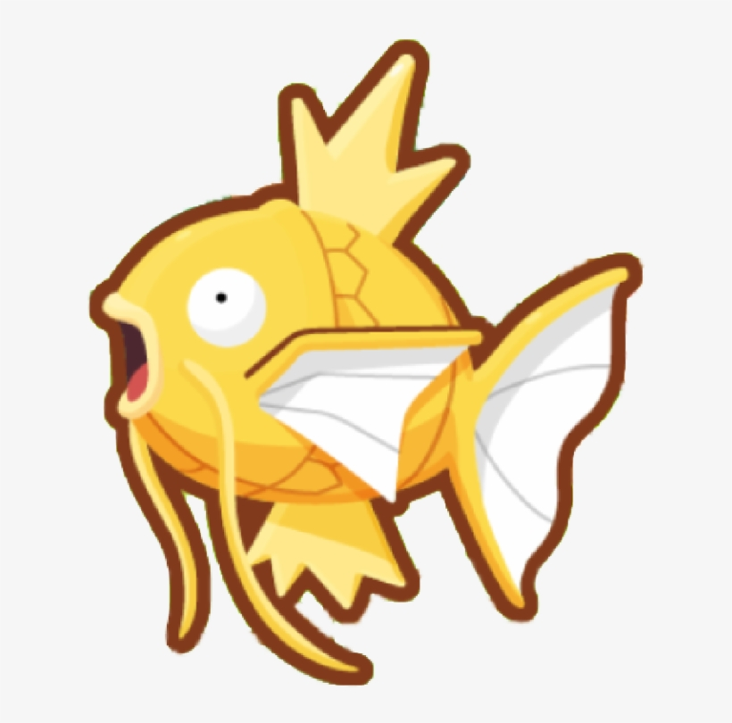

 
 <h2 align="center"><code> William's Readme Profile</code></h2>
 
Waiting to evolve into <b>gyarados!</b>

  

  
    

     
     
  

Welcome to my page!   I'm William, an aspiring software engineer. Recently graduated from Bandung Institute of Technology as a Computer Science student. Feel free to get in touch with me 😄.

<h3><strong>Familiar Tech Stack:</strong></h3>
<code></code>  
<code></code>
<code></code>
<code></code>
<code></code>
<code></code>
<code></code>
<code></code>
<code></code>
<code></code>
<code></code>
<code></code>
<code></code>
<code></code>
<code></code>
<code></code>

<h3><strong>Open Source Contribution</strong></h3>

<table>
  <thead align="center">
    <tr border: none;>
      <td><b>🎁 Projects</b></td>
      <td><b>⭐ Stars</b></td>
      <td><b>📚 Forks</b></td>
      <td><b>🛎 Issues</b></td>
      <td><b>📬 Pull requests</b></td>
    </tr>
  </thead>
  <tbody>
    <tr>
      <td><a href="https://github.com/elebumm/RedditVideoMakerBot"><b>RedditVideoMakerBot</b></a></td>
      <td></td>
      <td></td>
      <td></td>
      <td></td>
    </tr>
  </tbody>
</table>

<h3><strong>My Stats:</strong></h3>

 

  
 
   

   

<h3><strong>Current culture fit:</strong></h3>

- 🔭 I’m currently focusing my career on: Software Engineering, especially on Backend (Go, Java).
- 🌱 My undergraduate thesis is related to sentiment analysis using generative approach.
- ⚡ I’m currently learning: Scalability, Observability and System Design and best practice in backend software development.
- 📫 How to reach me: williamong1400@gmail.com

 

<h3><strong>My Project Templates</strong></h3>

<table>
  <tr>
    <th>No</th>
    <th>Lang / Framework</th>
    <th>Repo</th>
  </tr>
  <tr>
    <td>1</td>
    <td>Typescript (Express)</td>
    <td valign="top">
        
    </td>
  </tr>
  <tr>
    <td>2</td>
    <td>Golang</td>
    <td valign="top">
    
    </td>
  </tr>
</table>

------------

This <i>README</i> file is generated <b>every day</b> to update the my github stats!
